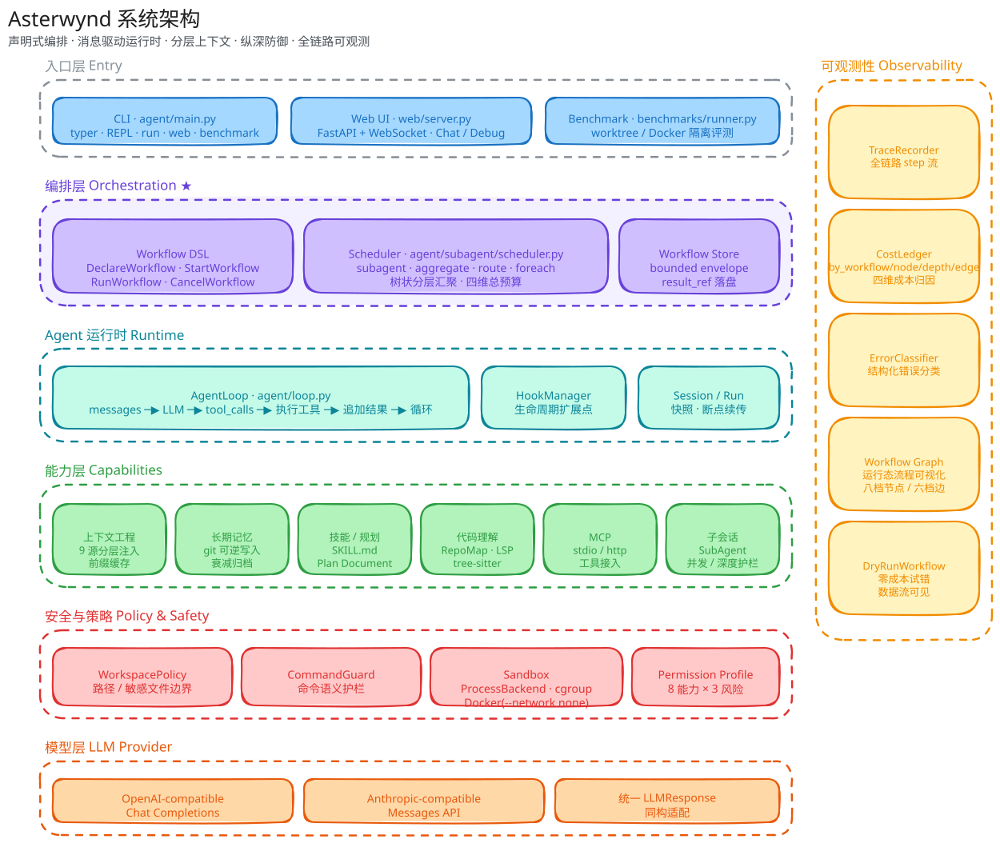
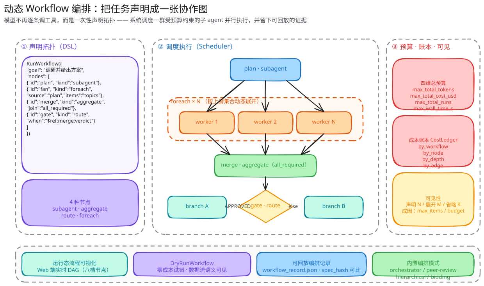
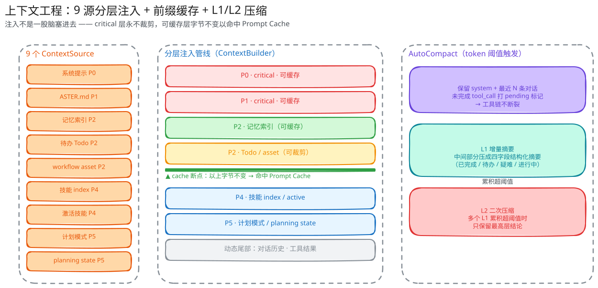
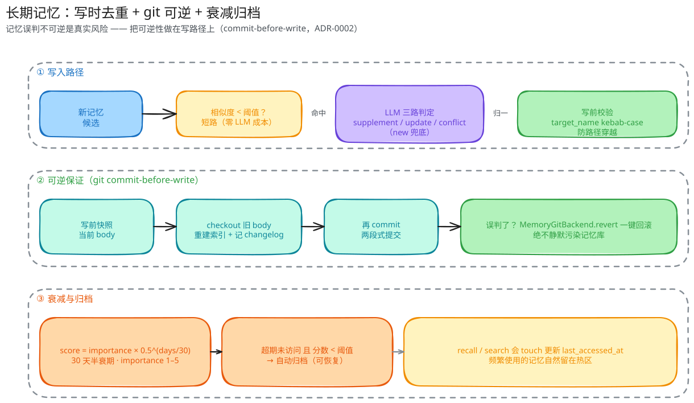
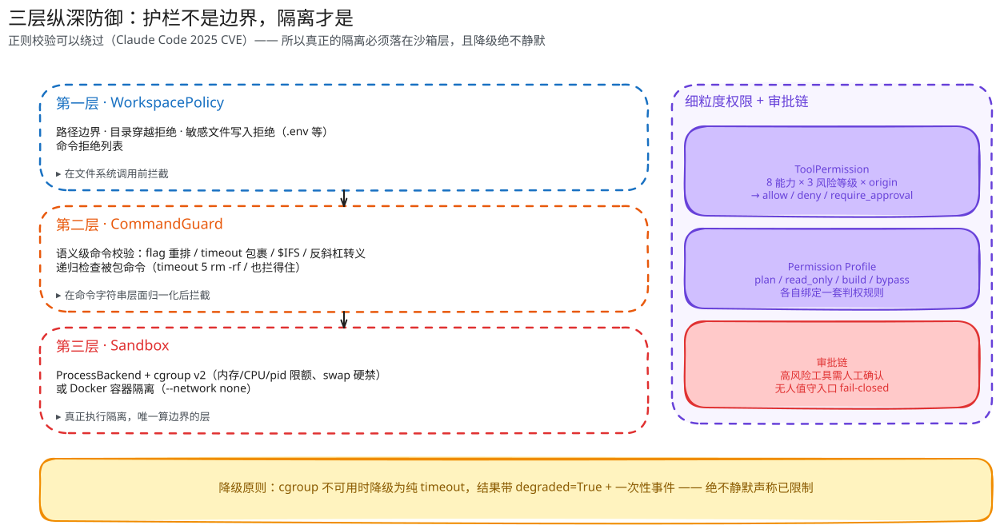
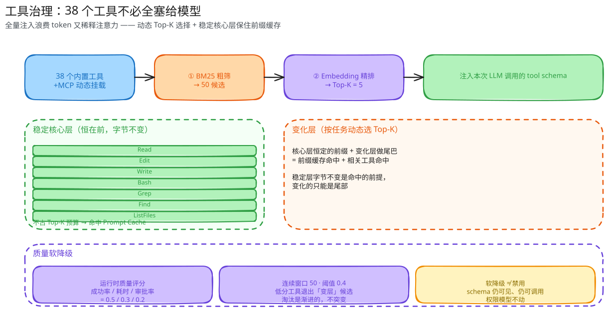
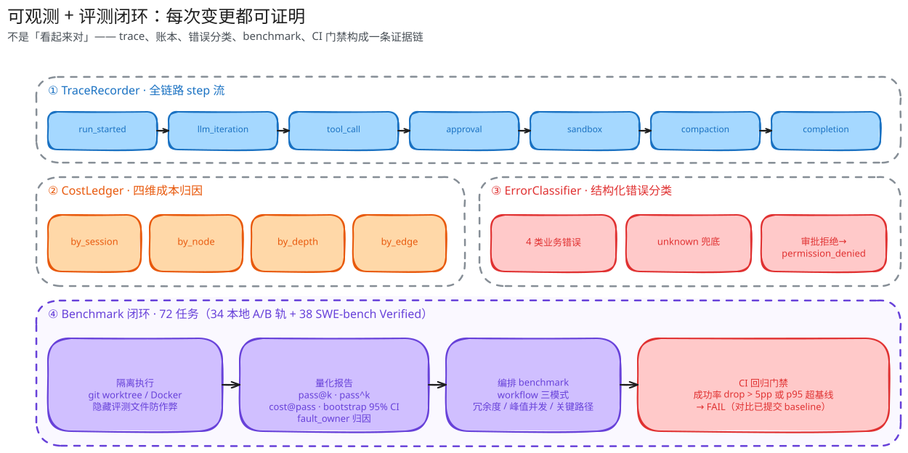

<p align="center">
  
</p>

<p align="center">
  <a href="./README.md">简体中文</a>
  ·
  <a href="./README_EN.md">English</a>
</p>

<p align="center">
  <strong>Navigate by stars. Prove with traces.</strong>
</p>

<p align="center">
  <a href="https://github.com/Xingkai98/asterwynd/actions/workflows/ci.yml"></a>
  
  
  
  
</p>

**Asterwynd** is a local coding agent that **assembles its own team**. It does not just call tools one at a time to edit files -- for a task, it can **declare the task as a collaboration graph** (parallel investigation / joins / conditional branches / dynamic fan-out), dispatch a group of budget-bounded subagents to execute it, and leave behind the **diff, cost ledger, tool trace, and replayable orchestration record** for every step -- so every code change is **provable**, not merely "looks correct".

Stars guide direction. Wind carries motion. Traces prove the journey.

<p align="center">
  
</p>

---

## Highlights

### 1 · Dynamic Workflow Orchestration -- declare a task as a collaboration graph

Most coding agents work by "the model calls tools one at a time"; when a task needs parallel investigation, multi-proposal review, or dynamic fan-out, they can only push through serially. Asterwynd lets the model **declare the collaboration topology in one shot**, and the system schedules the execution:

- **Declarative DSL**: `DeclareWorkflow` declares the topology and returns a `workflow_id`, `StartWorkflow` starts it, `GetWorkflow` queries bounded state, `CancelWorkflow` cancels it; `RunWorkflow` is the convenience form (internally Declare + Start).
- **4 node kinds**: `subagent` (one subagent run), `aggregate` (multi-upstream join), `route` (pick the next edge by structured result), `foreach` (dynamic parallel fan-out over a finite set).
- **2 join semantics**: `all_required` (wait for all) and `best_effort` (wait until the deadline, consume completed results, keep failure records) -- "no fail-fast on failure" is implemented only at the aggregate layer.
- **Tree-shaped hierarchical aggregation**: the model explicitly declares an aggregate tree (leaf->shard->domain->root); when a single aggregate has >10 direct upstreams the scheduler inserts hierarchical aggregates automatically, each layer bounded by a token budget (leaf 300 / shard 800 / domain 1500 / root 3000) -- **hundreds of leaves will not blow up the parent agent's context**.
- **Parent agent is always bounded**: the parent receives only a bounded envelope (`workflow_id`/`status`/`completed`/`failed`/`pending`/`root_result_ref`); child results spill to disk via `result_ref` and are inspected explicitly on demand, not expanded by default.
- **Zero-cost trial and error**: `DryRunWorkflow` shows how the graph will route and how text will flow without actually running it -- the model no longer needs to write a one-off real workflow to probe.

<p align="center">
   schedule -> budget/ledger/visibility" width="1000" />
</p>

**Why it is hard**: an orchestration system must simultaneously solve "valid topology" (4 node kinds + join semantics + a route on every cycle + a reducer declared when multiple in-edges write the same slot, all validated at schema time), "do not burn the budget" (four-dimension total budget + graph-level recursion limit + three gates), "do not drown the parent agent" (bounded envelope + hierarchical aggregation), and "visible at runtime" (runtime graph snapshots + truncation reported at three outlets). Asterwynd lands all four in implementation and spec.

---

### 2 · Context Engineering -- 9 sources layered injection + prefix cache + L1/L2 compaction

Injection is not "dump everything in". `ContextBuilder` orchestrates **9 context sources** (system prompt, ASTER.md, memory index, skills, plans, todos, and more) by priority (P0 highest):

- **Critical layers (P0/P1) are never truncated**; the **cacheable layers** (system prompt / ASTER.md / memory index) stay **byte-identical**, so Anthropic's `cache_control` breakpoint reliably hits the **Prompt Cache**; only P4/P5 (skills / plans) and the dynamic tail (conversation history, tool results) vary per round.
- **AutoCompact** triggers at a token threshold and compacts in L1/L2 layers: L1 turns the middle section into a four-field structured summary (completed / pending / difficulties-and-decisions / in-progress); when accumulated L1 summaries cross the threshold, L2 compacts to top-level conclusions.
- **The tool chain never breaks**: compaction drops intermediate tool results, so incomplete `tool_call`s are marked `[call#...: ... pending]` to keep the message chain valid.

<p align="center">
  
</p>

**Why it is hard**: the prefix cache demands "the stable prefix is byte-identical", yet the context must update every round -- these two conflict by nature. Asterwynd's answer is layering plus cache flags: split the invariant from the variable so cache hit rate and context freshness hold at the same time.

---

### 3 · Long-Term Memory -- write-time dedup + git reversibility + decay/archival

The biggest memory risk is not "forgetting", it is "misremembering and being unable to undo it". Asterwynd builds reversibility into the **write path**:

- **Write-time LLM three-way dedup**: `supplement` / `update` / `conflict` (`new` as fallback), short-circuiting when similarity is below threshold (zero LLM cost).
- **git commit-before-write**: snapshot before writing; a misjudgment can be rolled back two-phase with `MemoryGitBackend.revert` -- **never silently pollute the memory store** (contrast with mem0's ADD-only; the trade-off is recorded in [ADR-0002](./docs/adr/ADR-0002-long-term-memory-reversibility.md)).
- **importance x recency decay**: `score = importance x 0.5^(days/30)`, a 30-day half-life; entries not accessed past expiry and below the score threshold are auto-archived (recoverable); recall/search touches update `last_accessed_at`.

<p align="center">
  
</p>

**Why it is hard**: it treats "reversibility" as a first-class citizen. Most memory systems assume writes are correct; Asterwynd assumes writes may be wrong, so it designs the rollback channel together with the write channel.

---

### 4 · Three-Layer Defense in Depth -- guardrails are not boundaries, isolation is

The biggest cognitive trap in security is treating "regex validation" as a boundary. Asterwynd draws the line explicitly:

- **Layer 1 -- WorkspacePolicy**: path boundary + directory-traversal rejection + sensitive-file write rejection (`.env`, etc.).
- **Layer 2 -- CommandGuard**: semantic-level command validation covering bypass variants (flag reordering / `timeout` wrapping / `$IFS` / backslash escaping) and **recursively checking wrapped commands** (`timeout 5 rm -rf /` is still caught).
- **Layer 3 -- Sandbox**: `ProcessBackend` + cgroup v2 resource limits (`memory.max`/`memory.swap.max`, swap hard-disabled) or Docker container isolation (`--network none`) -- **this is the only boundary**.
- **Fine-grained permissions**: `ToolPermission` decides by 8 capabilities x 3 risk levels x origin; `plan`/`read_only`/`build`/`bypass` each bind a profile; high-risk tools require approval and unattended entry points fail-closed.
- **Degradation is never silent**: when cgroup is unavailable it degrades to a plain timeout, with `degraded=True` + a one-time event -- never falsely claiming "limited".

<p align="center">
  
</p>

**Why it is hard**: distinguishing a "guardrail" from a "boundary" -- guardrails reduce risk, only boundaries truly isolate. Honestly labeling the degraded state matters more than pretending to be safe.

---

### 5 · Tool Governance -- 40 tools need not all be handed to the model

Once tools multiply, full injection both wastes tokens and dilutes attention. Asterwynd does **dynamic Top-K selection**:

- **Two-stage recall**: BM25 coarse filter to 50 -> embedding re-rank to **Top-K = 5** injected into the current LLM call.
- **Stable core layer**: the registered core tools in `CORE_STABLE_TOOL_NAMES` (`Read`/`Edit`/`Write`/`Bash`/`Grep`/`InspectGitDiff`) are always first and byte-identical, **not counted against the Top-K budget** -- the stable prefix preserves the Prompt Cache, and only the tail varies.
- **Quality soft-degradation**: runtime scoring by "success rate / latency / approval rate = 0.5 / 0.3 / 0.2" (window 50, threshold 0.4); low-scoring tools drop out of the "variable layer" candidates -- **soft degradation, not disabling**: the schema remains visible and callable, and the permission model is untouched.
- **Zero-dependency default**: built-in NGramEmbedding, swappable for a real embedding provider.

<p align="center">
  
</p>

**Why it is hard**: "save tokens" and "hit the cache" are two goals that fight each other -- dynamic selection changes the injection every round, which kills the cache. The answer is to carve out an invariant stable layer and let only the tail change.

---

### 6 · Observability + Evaluation Loop -- every change is provable

Not "looks correct", but a chain of evidence:

- **TraceRecorder**: a full step stream (`run_started` -> `llm_iteration` -> `tool_call` -> `approval` -> `sandbox` -> `compaction` -> `completion`).
- **CostLedger attribution**: on top of the legacy `by_session` / `by_phase` / `by_tool`, it adds four workflow dimensions `by_workflow` / `by_node` / `by_depth` / `by_edge` -- answering "which node is most expensive, which layer repeats the most tokens, how much do dynamic vs fixed patterns differ".
- **ErrorClassifier**: structured error classification (4 business classes + `unknown` fallback; approval rejection maps to `permission_denied`).
- **Runtime graph visualization**: a live DAG in the Web UI (eight node statuses, six edge statuses, route control edges listed separately, desktop/mobile dual layout).
- **Benchmark loop**: **72 tasks** (34 local + 38 SWE-bench Verified) executed in git worktree / Docker isolation with hidden evaluation files to prevent cheating, producing pass@k / pass^k / cost@pass / bootstrap 95% CI / `fault_owner` attribution; the CI regression gate compares against a baseline (success-rate drop > 5pp or p95 over baseline -> FAIL).

<p align="center">
  
</p>

**Why it is hard**: decouple "process record" from "financial record" (trace vs cost ledger), make "reproducible" real (fixed-seed bootstrap), build "anti-cheat" into isolation (hide task files before evaluation), and honestly label the boundary (hallucination-class errors are not auto-classified; they need an LLM judge).

---

## Built by an Agent, for an Agent

Asterwynd develops itself with **an engineering loop it defines itself** -- not a one-off demo, but a standing development discipline:

```
Requirement discussion -> OpenSpec proposal (proposal / design / tasks / spec-delta)
        -> independent subagent design grilling (grill, itemized decisions + stop-turn user confirmation)
        -> independent zero-memory subagent adversarial verification (tries to refute the design conclusions)
        -> implementation (isolated git worktree, tests first)
        -> independent subagent review loop (review -> fix -> re-review, until PASS or a 3-round cap)
        -> CI gates (full pytest + OpenSpec strict validate + artifact checker + benchmark-gate)
        -> archival close-out (spec sync + change archival + backlog cleanup)
```

This process is itself machine-enforced: protected paths require structured events, reviews require a review manifest bound to hashes, grills require a structured decision record, and branch names must derive the change-id. **Every change in this project walks this path -- including this README.**

---

## Quick Start

```bash
# Install (uv recommended)
uv sync --extra dev

# Configure API keys (OpenAI or Anthropic-compatible endpoints both work)
cp .env.example .env
# Edit .env: set OPENAI_API_KEY or ANTHROPIC_API_KEY
# Optional: OPENAI_BASE_URL for any OpenAI-compatible API (DeepSeek / OrcaRouter, etc.)
# Optional: ASTERWYND_PROVIDER (openai / anthropic), ASTERWYND_MODEL as defaults

uv run asterwynd run "Hello"          # CLI single run
uv run asterwynd                       # CLI interactive mode
uv run asterwynd web --port 8000       # Web UI
uv run pytest -q                       # run tests

# Local benchmark (fake runner smoke, deterministic)
uv run asterwynd benchmark benchmarks/tasks \
  --agent fake --source-repo . --runs-dir /tmp/smoke \
  --fake-edit-file README.md \
  --fake-old-string 'Asterwynd' --fake-new-string 'Asterwynd Coding Agent'
```

`uv run` is the recommended environment isolation (more reproducible dependencies), not a requirement to run the app -- when the environment is ready, `asterwynd run "Hello"` / `pytest -q` are equivalent.

<details>
<summary><b>More run modes (provider override / Web Debug / orchestration benchmark)</b></summary>

```bash
# Override provider / model
uv run asterwynd run --provider anthropic --model claude-sonnet-4-20250514 "Hello"

# Web UI + verbose logging (records LLM input/output)
ASTERWYND_LOG_LEVEL=DEBUG uv run asterwynd web --port 8000 --model deepseek-v4-pro

# Web Debug view (Chat + Debug dual view)
ASTERWYND_DEBUG=enabled uv run asterwynd web --host 127.0.0.1 --port 8000

# Orchestration benchmark: let the model freely generate a workflow and record it on the side
uv run asterwynd benchmark benchmarks/tasks --agent asterwynd \
  --provider anthropic --model deepseek-v4-flash \
  --workflow-mode dynamic-record --runs-dir /tmp/record
```

Interactive mode has built-in slash commands: `/help`, `/status`, `/mode <build|read_only|plan|bypass>`, `/clear`, `/compact`, `/skills`, `/skills reload`, `/mcp`, `/<skill-name> <request>`, `/exit`.

</details>

---

## Web UI

```bash
uv run asterwynd web --port 8000                          # basic startup
ASTERWYND_DEBUG=enabled uv run asterwynd web --port 8000  # enable the Debug view
```

- **Chat view**: Markdown rendering, tool-call visualization, long-result folding, session/run/mode display, Plan Document + planning state, approval cards.
- **Debug view**: per-round display of the full message list sent to the LLM, LLM responses, tool-call details, and memory compaction events.
- **Workflow view**: a live runtime DAG (node/edge status highlighting, route control edges listed separately, desktop/mobile dual layout).

You can switch `build` / `read_only` / `plan` / `bypass` modes within a session. Each startup writes an independent log file under the platform user log directory (`platformdirs.user_log_path("asterwynd")`).

<details>
<summary><b>Environment variables and config precedence</b></summary>

| Environment Variable | Default | Description |
|---------|--------|------|
| `ASTERWYND_PROVIDER` | `openai` | LLM provider: `openai` or `anthropic` |
| `ASTERWYND_MODEL` | provider default | Model name |
| `ASTERWYND_LOG_LEVEL` | `INFO` | At `DEBUG`, logs LLM request payloads and raw response JSON |
| `ASTERWYND_DEBUG` | `disabled` | When `enabled`, turns on the Debug Web UI |

Config precedence: explicit CLI arguments > process environment variables > `.env` loaded values > `asterwynd.yaml` > code defaults. API key / base URL / provider / model / debug / log level use `.env` or env vars; agent mode, permission profiles, tool policy, tool-result display thresholds, and benchmark defaults use `asterwynd.yaml`.

</details>

---

## Project Structure

```text
agent/
├── loop.py                  # AgentLoop core (message-driven main loop)
├── llm.py                   # LLM Protocol + ToolCallDelta
├── openai_llm.py            # OpenAI Chat Completions implementation
├── anthropic_llm.py         # Anthropic Messages API implementation
├── workspace_policy.py      # Workspace safety boundary
├── trace_recorder.py        # Full trace recording
├── cost_tracker.py          # Cost ledger (four-dimension attribution)
├── observability.py         # Structured error classification
├── context/                 # ContextBuilder injection pipeline + Summarizer
├── memory/                  # MemoryManager + AutoCompact + long-term memory + git backend
├── tools/
│   ├── registry.py          # ToolRegistry
│   ├── sandbox/             # ProcessBackend / cgroup / Docker backends
│   ├── command_guard.py     # Command semantic guard
│   ├── governance/          # Dynamic Top-K tool selection + quality soft-degradation
│   └── builtin/             # Built-in tools (file/command/browser/search/subagent, etc.)
├── subagent/
│   ├── scheduler.py         # Workflow scheduler (DAG execution + budget + hierarchical aggregation)
│   ├── workflow.py          # Workflow DSL data structures and schema validation
│   ├── patterns.py          # 4 built-in orchestration patterns (compiled to DSL templates)
│   ├── manager.py           # Sub-session runtime (concurrency / depth / budget guardrails)
│   ├── bus.py               # Lightweight message bus (non-authoritative)
│   └── snapshot.py          # Snapshot and recovery
├── workflow/                # Dev-workflow state machine + event log + review manifest
└── skills/ planning/ mcp/ browser/ code_intelligence/ lsp/  # Supporting capabilities

web/                         # FastAPI + WebSocket (Chat / Debug / Workflow views)
benchmarks/                  # Local runner + 72 tasks + statistics / gate / compare
docs/                        # Architecture / development guide / testing guide / ADR / interview material
openspec/                    # Requirements and specs (specs/ confirmed specs, changes/ in-flight changes)
```

---

## Architecture

- **Core loop**: `AgentLoop.run()` is the single state manager; `messages` is the only mutable state. Tool execution, memory compaction, and sub-session runtime hold references via dependency injection. Tool-call message chain validity is enforced by the API.
- **Orchestration layer**: `agent/subagent/scheduler.py` executes the DAG compiled from the Workflow DSL, managing the node state machine, data slots, budget gates, and hierarchical aggregation.
- **Observability stack**: TraceRecorder (process) + CostLedger (cost) + ErrorClassifier (errors) + runtime graph snapshots form the full-chain evidence surface.
- **Plugin surface**: 7 Hook lifecycle cut-points; `@tool_parameters` declarative tool registration; directory-style skill loading; MCP via stdio / Streamable HTTP.

<details>
<summary><b>Full module table and built-in tool list</b></summary>

| Module | Description |
|------|------|
| **AgentLoop** | Message-driven main loop; `messages` is the only state, capabilities delegated to plugins |
| **ToolRegistry** | `@tool_parameters` declarative registration; 40 built-in tools + MCP dynamic mounting |
| **Tool Governance** | BM25 + embedding dynamic Top-K; stable core layer preserves the prefix cache; quality soft-degradation |
| **Code Intelligence** | Tree-sitter (TS/JS, Go, Rust, Java, Kotlin) + Python AST symbol extraction; RepoMap; Python LSP semantic tools |
| **WorkspacePolicy** | Path traversal rejection, sensitive-file write rejection, command deny list |
| **CommandGuard** | Command semantic guard (flag reordering / timeout wrapping / `$IFS` / backslash escaping) |
| **Sandbox** | ProcessBackend + cgroup v2 / Docker (`--network none`); degradation is never silent |
| **HookManager** | 7 lifecycle cut-points; built-in logging/retry/tracing/budget hooks |
| **MemoryManager** | AutoCompact (L1/L2 compaction, tool_call pending markers); long-term memory (write-time dedup + git-reversible + decay) |
| **ContextBuilder** | 9 ContextSource layered injection; static-source cache + stable prefix (Prompt Cache breakpoint) |
| **SubAgentManager** | Sub-session runtime: independent transcripts, repeated runs, concurrency queue, depth guardrails, snapshot recovery |
| **Workflow Scheduler** | Declarative DSL execution: 4 node kinds / 2 join semantics / hierarchical aggregation / four-dimension budget / bounded envelope |
| **Orchestration Patterns** | 4 built-in patterns (orchestrator-worker / peer-review / hierarchical / bidding), compiled to DSL templates |
| **Browser** | Controlled read-only browser (navigation, screenshot, content extraction, tabs) with safety policy |
| **MCP Adapter** | stdio / Streamable HTTP server integration, registering `mcp__<server>__<tool>` |
| **Observability** | TraceRecorder + CostLedger (four-dimension) + ErrorClassifier + runtime graph visualization |
| **Benchmark** | 72 tasks (34 local + 38 SWE-bench Verified); workflow three modes; CI regression gate |

**Built-in tools (40, including default-off browser tools)**:

| Category | Tools |
|------|------|
| File read/write | `Read` · `ReadDoc` · `Write` · `Edit` · `ListFiles` · `Find` · `Grep` · `InspectGitDiff` |
| Command execution | `Bash` (structured output: exit_code / stdout / stderr / duration / timed_out) |
| Code intelligence | `RepoMap` · `SymbolSearch` · `LspDefinition` · `LspReferences` · `LspHover` · `LspDocumentSymbols` · `LspWorkspaceSymbols` · `LspDiagnostics` |
| Web research | `WebSearch` · `WebFetch` |
| Memory | `SaveMemory` · `RecallMemory` · `SearchMemory` · `ResolveMemoryConflict` · `MemoryGitBackend` |
| Planning & interaction | `UpdatePlan` · `ExitPlanMode` · `TodoWrite` · `AskUserQuestion` |
| Skills & tasks | `ActivateSkill` · `TaskOutput` · `TaskStop` |
| Worktree | `EnterWorktree` · `ExitWorktree` |
| Browser (default off) | `BrowserNavigate` · `BrowserGetContent` · `BrowserScreenshot` · `BrowserScroll` · `BrowserListTabs` · `BrowserSwitchTab` · `BrowserCloseTab` |

Command safety: permission is decided first by the mode permission profile; in the default `build` mode high-risk commands require approval, and unattended entry points such as single-run CLI and benchmark fail-closed (auto-allowed only under an explicit `bypass` mode). Before execution it still checks the regex deny list (`rm -rf /`, fork bombs, `curl | sh`, etc.) then matches allowed safe prefixes. Project-level rules are extended via `asterwynd.yaml`; see `asterwynd.example.yaml`.

</details>

<details>
<summary><b>Extension guide (add a tool / Hook / skill)</b></summary>

**Add a tool**: create `agent/tools/builtin/my_tool.py`, inherit from the `Tool` ABC and declare the schema with `@tool_parameters`; import it in `agent/tools/__init__.py` and add it to `get_default_tools()`; register it in `ToolRegistry`.

```python
from agent.tools import Tool, tool_parameters, ToolRegistry

@tool_parameters(
    name="MyTool",
    description="What it does",
    parameters={"type": "object", "properties": {"arg": {"type": "string"}}},
)
class MyTool(Tool):
    read_only = True

    async def execute(self, arg: str, **kwargs) -> str:
        return f"result: {arg}"

registry = ToolRegistry()
registry.register(MyTool())
```

**Add a Hook**: implement the `Hook` Protocol (7 lifecycle methods, all may be no-ops) and pass it into `HookManager([MyHook()])`.

```python
from agent.hooks import HookManager, Hook

class MyHook(Hook):
    async def on_run_started(self, run_config): ...
    async def before_iteration(self, iteration, messages): ...
    async def after_llm_call(self, response): ...
    async def before_tool_execute(self, tool_call): ...
    async def after_tool_execute(self, tool_call, result): ...
    async def on_error(self, error): ...
    async def on_completion(self, result): ...
```

**Add a skill**: create a directory-style skill at `skills/<name>/SKILL.md` (YAML frontmatter + prompt body).

```markdown
---
name: my-skill
description: Skill description
tools: [Read, Bash]
always: false
user_invocable: true
argument_hint: <request>
triggers:
  - trigger phrase
---

# Skill Title

Prompt instructions go here...
```

Each run injects a concise skill index into model-visible context; the full skill prompt is injected only for `always: true`, a local match, an explicit `/my-skill ...` call, or `ActivateSkill` tool activation. Interactive mode provides `/skills` to inspect loaded skills and `/skills reload` to reload configured skill roots.

</details>

---

## Benchmark

The built-in runner covers **72 tasks** (34 local A/B-track + 38 `swebench-*` Verified subset), executed in git worktree / Docker isolation.

```bash
# Real agent evaluation
uv run asterwynd benchmark benchmarks/tasks --agent asterwynd --source-repo . --runs-dir /tmp/bench

# Repeated runs + quantitative report (pass@k / pass^k / cost@pass / bootstrap CI / fault_owner)
uv run asterwynd benchmark benchmarks/tasks \
  --agent fake --source-repo . --runs-dir /tmp/eval --repeat 3 --parallel 1

# CI regression gate (compare against committed baseline; >5% degradation exits non-zero)
uv run asterwynd benchmark-gate benchmarks/tasks/gate-smoke \
  --source-repo . --baseline benchmarks/baseline.json --require-baseline
```

<details>
<summary><b>Orchestration benchmark (workflow three modes) and evaluation flow</b></summary>

`--workflow-mode` lets the benchmark measure the quality of the orchestration itself:

| Mode | Meaning |
|---|---|
| `template` | A fixed Pattern/DSL template is the orchestration under test and goes through the existing verifier (fixed baseline) |
| `dynamic-record` | The model freely generates a workflow; a normalized spec plus orchestration metrics are recorded on the side while it runs |
| `dynamic-replay` | Reads the saved record, skips the planning model entirely, and replays offline; compares orchestration only, does not score |

```bash
uv run asterwynd benchmark benchmarks/tasks \
  --agent asterwynd --provider anthropic --model deepseek-v4-flash \
  --workflow-mode dynamic-record --runs-dir /tmp/record

uv run asterwynd benchmark benchmarks/tasks \
  --agent asterwynd --provider anthropic --model deepseek-v4-flash \
  --workflow-mode dynamic-replay --workflow-record /tmp/record --runs-dir /tmp/replay
```

The report gains a separate workflow orchestration section (redundancy / graph steps / rejection-degradation counts / node count / peak concurrency / critical path / orchestration cost), and the main table gains only a `workflow_mode` column; `dynamic-replay` records stay out of the pass@k denominator.

**Evaluation flow (local tasks)**: create an isolated worktree at base_commit -> hide `benchmarks/tasks/` (anti-cheat) -> run the agent -> capture the change diff (`:!tests/` excludes test files) -> reset the worktree and replay the source changes -> apply `test.patch` (hidden evaluation tests) -> run the validation command -> write `result.json` / `trace.json` / `runner.log`. Result statuses: `passed` / `passed_with_warnings` / `unsupported` / `failed` / `error`; detailed attribution goes into `reason`.

</details>

---

## Docs Map

| Doc | Content |
|------|------|
| [Project Positioning](./docs/project-positioning.md) | Target roles, mainline/supporting capabilities, capability proof chain |
| [Context Glossary](./CONTEXT.md) | Core project language for requirements, roadmap, and interview material |
| [Architecture](./docs/architecture.md) | AgentLoop, tool system, orchestration, context, memory, Web UI, Benchmark |
| [Development Guide](./docs/development-guide.md) | Install, run, common commands, env vars, development process |
| [Testing Guide](./docs/testing-guide.md) | Test layers, regression-test rules, coverage requirements |
| [Agent Internals](./docs/agent-internals.md) | Chapter-by-chapter code walkthrough (main loop / tools / context) |
| [Lessons Learned](./docs/lessons-learned.md) | Historical issues, root causes, lessons to carry forward |
| [ADR](./docs/adr/) | Architecture decision records (long-term memory storage and reversibility, etc.) |
| [OpenSpec](./openspec/project.md) | Capability domain map; `specs/` confirmed specs, `changes/` in-flight changes |
| [Interview Script](./docs/interview-script/README.md) | Layered script + code walkthrough |
| [Change Backlog](./docs/openspec-change-backlog.md) | Unimplemented OpenSpec changes and suggested order |
| [Benchmark Plan](./docs/benchmark-plan.md) | Task set, runner, metrics, and result design |

## Tech Stack

Python 3.11+ / asyncio / FastAPI + WebSocket / httpx / typer / tree-sitter / tiktoken (optional)

## Acknowledgements

- [OrcaRouter](https://www.orcarouter.ai/ref/ref_4c1cf5a5bb71174f474d) — a multi-model gateway with free models such as DeepSeek and Qwen. Set `OPENAI_BASE_URL` to `https://api.orcarouter.ai/v1` to use it with Asterwynd.

> Chinese source: [README.md](./README.md)
